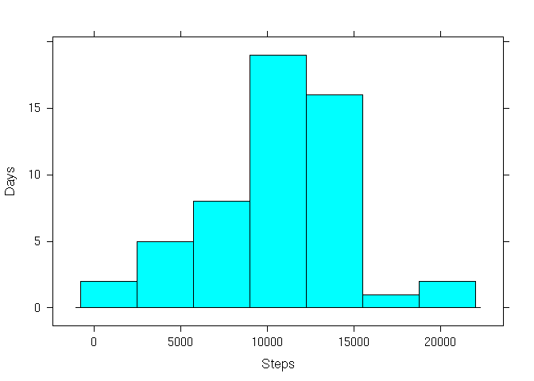
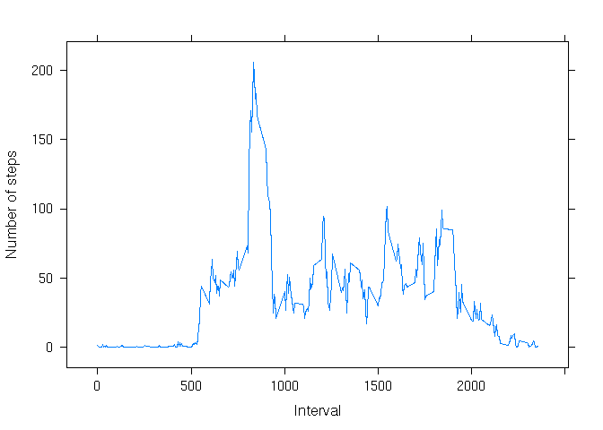
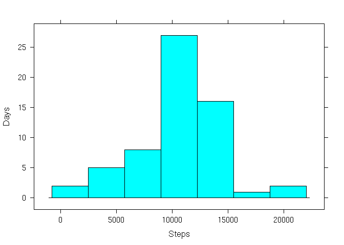
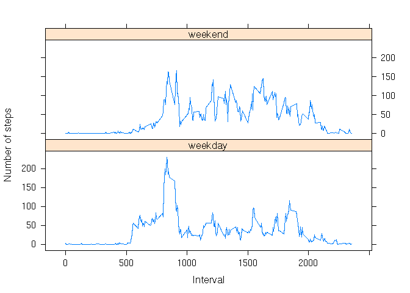

# Reproducible Research: Peer Assessment 1


## Loading and preprocessing the data


```r
library(dplyr)
library(lattice)
```


```r
activity<- read.csv(unzip("activity.zip"))
activity.complete<- activity[complete.cases(activity),]
```


## What is mean total number of steps taken per day?
calculate the number of steps per day


```r
activity.by_day<-
  activity.complete %>%
  group_by(date) %>%
  summarize(steps = sum(steps))
```

make an histogram of the steps per day


```r
histogram(
  ~steps,
  data=activity.by_day,
  type="count",
  xlab="Steps",
  ylab="Days"
  )
```

 

calculate the mean of the steps per day

```r
mean(activity.by_day$steps)
```

```
## [1] 10766.19
```

calculate the median of the steps per day

```r
median(activity.by_day$steps)
```

```
## [1] 10765
```


## What is the average daily activity pattern?
Make a time series plot (i.e. type = "l") of the 5-minute interval (x-axis) and the average number of steps taken, averaged across all days (y-axis)


```r
activity.by_interval<-
  activity.complete %>%
  group_by(interval) %>%
  summarize(steps = mean(steps))

xyplot(
  steps ~ interval, 
  data = activity.by_interval,
  type = "l",
  xlab = "Interval",
  ylab = "Number of steps"
  )
```

 

Which 5-minute interval, on average across all the days in the dataset, contains the maximum number of steps?


```r
unlist(arrange(activity.by_interval, desc(steps))[1,"interval"])
```

```
## interval 
##      835
```


## Imputing missing values
Calculate and report the total number of missing values in the dataset (i.e. the total number of rows with NAs)


```r
missing<- which(is.na(activity$steps))
length(missing)
```

```
## [1] 2304
```

Devise a strategy for filling in all of the missing values in the dataset. The strategy does not need to be sophisticated. For example, you could use the mean/median for that day, or the mean for that 5-minute interval, etc.

Create a new dataset that is equal to the original dataset but with the missing data filled in.

*We fill the missing data using the mean for that interval*


```r
interval_to_steps<- function(x) {
  activity.by_interval[activity.by_interval$interval == x,]$steps
}

activity.guessed<-
  activity[missing,] %>%
  mutate(steps = sapply(interval, interval_to_steps))

activity.filled<- rbind(activity.complete, activity.guessed)
```

Make a histogram of the total number of steps taken each day and Calculate and report the mean and median total number of steps taken per day. 


```r
activity.filled.by_day<-
  activity.filled %>%
  group_by(date) %>%
  summarize(steps = sum(steps))

histogram(
  ~steps,
  data=activity.filled.by_day,
  type="count",
  xlab="Steps",
  ylab="Days"
  )
```

 

Mean of the steps per day

```r
mean(activity.filled.by_day$steps)
```

```
## [1] 10766.19
```

Median of the steps per day

```r
median(activity.filled.by_day$steps)
```

```
## [1] 10766.19
```

Do these values differ from the estimates from the first part of the assignment? What is the impact of imputing missing data on the estimates of the total daily number of steps?

    The values don't show a significant difference from the previous estimate.
    Filling the missing data has a mimimal impact

## Are there differences in activity patterns between weekdays and weekends?

Use the dataset with the filled-in missing values for this part.

Create a new factor variable in the dataset with two levels – “weekday” and “weekend” indicating whether a given date is a weekday or weekend day.


```r
date_to_daytype<- function(x) {
  wd<- weekdays(as.Date(x))
  if (wd == "Sunday" || wd == "Saturday")
    "weekend"
  else
    "weekday"
}
  

activity.with_daytype<-
  activity.filled %>%
  mutate(daytype = sapply(date, date_to_daytype))
```

Make a panel plot containing a time series plot (i.e. type = "l") of the 5-minute interval (x-axis) and the average number of steps taken, averaged across all weekday days or weekend days (y-axis). 


```r
activity.by_interval_and_daytype<-
  activity.with_daytype %>%
  group_by(interval, daytype) %>%
  summarize(steps = mean(steps))


xyplot(
  steps ~ interval | daytype, 
  data = activity.by_interval_and_daytype,
  type = "l",
  xlab = "Interval",
  ylab = "Number of steps",
  layout=c(1,2)
  )
```

 
    
